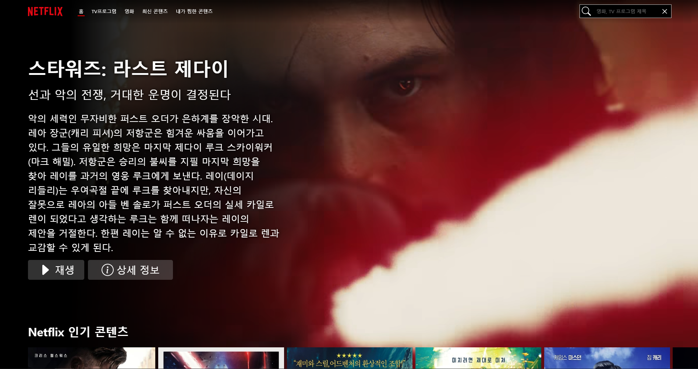

# Netflix clone coding



> 공유된 멘탈 모델을 바탕으로 유스케이스와 사용자 모델을 역기획하여 실제 서비스와 유사하게 개발 시도했습니다.

- 프로젝트 개발 환경 설정 및 리덕스 스타일 가이드를 따르는 아키텍처 설계
- RESTful API 기반의 미디어 검색 및 리스트 출력 기능 구현
- 이미지 지연 로딩을 통한 초기 로딩 속도 개선 및 무한 스크롤 기능 구현
- React Hook을 사용하여 로직 재사용성을 높이고 코드 복잡도를 낮춤

## 시작하기

```bash
# 설치하기
npm install

# 앱 실행하기
npm run start
```
